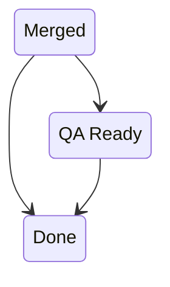

<h1 align="center">
    🤖<br>
    linear-reminder
</h1>
<div align="center">
    <strong>A webhook server for automating Linear reminders written in Rust and served with <a href="https://www.shuttle.rs">Shuttle</a>.</strong>
</div>
<br>
<div align="center">
  <a href="https://github.com/lukehsiao/linear-reminder/actions/workflows/general.yml">
    </a>
  <a href="https://github.com/lukehsiao/linear-reminder/blob/main/LICENSE">
    
  </a>
</div>
<br>

`linear-reminder` is a simple demo webhook server written using [Rocket](https://rocket.rs) for automating a specific workflow of reminders in [Linear](https://linear.app).

## The workflow

Suppose you have an intermediate status that your devs tickets go to.
For example, maybe you have a `Merged` state tickets go to as soon as their associated pull requests merge.
However, `Merged` is not the final desired state.
Perhaps these tickets need to move from `Merged` to either `QA Ready` or `Done`.



But, it's easy to forget that, so you want some way to remind people to move the ticket along by posting a comment on tickets which are sitting in `Merged` for some amount of time.

`linear-reminder` is a webhook server to accomplish that.

## Configuration

This server can be configured using standard [Rocket configuration](https://rocket.rs/guide/v0.5/configuration/).
Specifically, we add the following configuration options.

```toml
# Rocket.toml
[default]
# The amount of time to wait between an issue hiting the `target_status` and a reminder being sent.
# This is provided in "humantime" format (e.g, 15days 3hr 3min)
time_to_remind = '30min'

[default.linear]
# Your Linear personal api Key
api_key = 'insert-here'
# Your Linear webhook signing key
signing_key = 'insert-here'
# The target status to send reminders for
target_status = 'Merged'
# The content of the comment to send as the reminder.
message = '''
If this issue is QA-able, please write instructions and move to `QA Ready`. If not, mark it as `Done`. Thanks!

*This is an automated message.*'''
```

These can be overridden using [Shuttle Secrets](https://docs.shuttle.rs/resources/shuttle-secrets) when deployed.
```toml
# Secrets.toml
'ROCKET_LINEAR.API_KEY' = 'lin_api_fillinyourkey'
'ROCKET_LINEAR.SIGNING_KEY' = 'lin_wh_fillinyourotherkey'
'ROCKET_LINEAR.TARGET_STATUS' = 'Limbo'
'ROCKET_LINEAR.MESSAGE' = 'Get out of Limbo.'
'ROCKET_TIME_TO_REMIND' = '10min'
```
